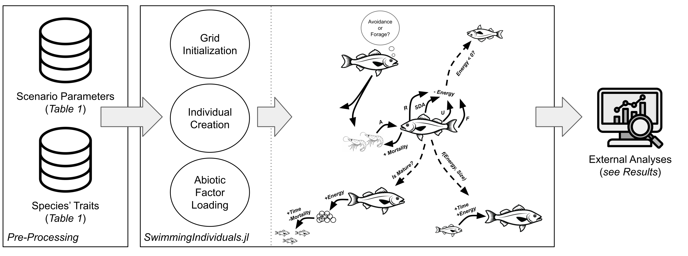
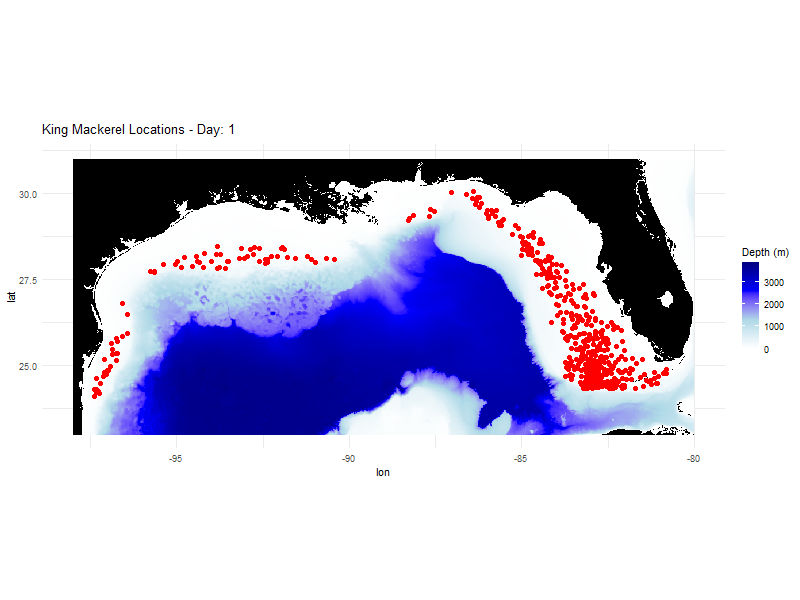

# SwimmingIndividuals.jl: A High-Performance Agent-Based Model for Marine Ecosystems



**SwimmingIndividuals.jl** is a flexible, high-performance agent-based model (ABM) written in the Julia programming language. It is designed to simulate the life histories, behaviors, and population dynamics of marine organisms interacting with a dynamic environment and human systems like fisheries. The model is built for performance, with a dual CPU/GPU architecture that allows for the efficient simulation of millions of individual agents.

---

## Key Features

- **Individual-Based:** Emergent population dynamics arise from the bottom-up decisions of individual agents.
- **Data-Driven Environment:** Initializes complex, time-varying habitats from standard NetCDF files.
- **Detailed Bioenergetics:** A "Wisconsin"-style bioenergetics model governs agent growth, reproduction, and starvation based on energy consumption.
- **Flexible Behavior:** Supports multiple behavioral archetypes, including Diel Vertical Migration (DVM) and the dive cycles of air-breathing animals.
- **Mechanistic Predation:** Combines a high-resolution, agent-on-agent predation model with a background functional response for diffuse predators.
- **Fisheries Impact Module:** Simulates the effects of commercial and recreational fishing with detailed regulations (quotas, seasons, size limits).
- **High-Performance Architecture:** Utilizes Julia's performance features and `KernelAbstractions.jl` to run efficiently on both multi-core CPUs and NVIDIA GPUs.

---

## Function Reference

The model is organized into several modules, each responsible for a specific part of the simulation logic.

### `model.jl` (Main Script)
This is the primary entry point for the simulation.
- **`runSI()`**: The main function that initializes all components (environment, agents, fisheries), assembles the `MarineModel` object, and starts the simulation by calling `update!`.

### `utilities.jl`
Defines the core data structures used throughout the model.
- **`MarineModel`**: The central struct holding the entire state of the simulation.
- **`MarineEnvironment`**: A flexible dictionary-based struct to hold environmental data grids.
- **`MarineSimulation`**: A container that bundles the model state with run-specific parameters.
- **`plankton`, `resource`**: Structs defining the properties of focal species and resource agents.
- **Helper Functions**: Contains mathematical and spatial helpers like `haversine`, `lognormal_params_from_minmax`, and `get_cell_id`.

### `create.jl`
Handles the creation and reproduction of all agents.
- **`generate_individuals()`**: Top-level function that creates all focal species agents based on initial biomass targets.
- **`construct_individuals()`**: Defines the `StructArray` that holds all agent data, adding fields for state variables and the spatial index.
- **`initialize_individuals()`**: Populates the agent `StructArray` with individuals until a target biomass is met, assigning properties based on statistical distributions.
- **`initialize_resources()`**: Creates the resource patches as a `StructArray`, distributing their biomass based on habitat capacity.
- **`process_reproduction!()`**: A GPU-compliant function that manages the "Gather, Compute, Update" pattern for creating new offspring from parents that have accumulated reproductive energy.

### `environment.jl`
Manages the physical world of the simulation.
- **`generate_environment!()`**: Loads all environmental data (e.g., `temp`, `salinity`, `bathymetry`) from a single `environment.nc` file into the `MarineEnvironment` struct, ensuring all data grids are on the correct CPU/GPU device.
- **`initial_habitat_capacity()`**: Calculates a 4D `(lon, lat, month, species)` habitat suitability grid by comparing species' environmental preferences (from a CSV) to the environmental data.
- **`individual_temp_kernel!()`**: A GPU kernel that efficiently finds the 3D temperature for every agent based on its grid location.

### `simulation.jl` & `update.jl`
The engine that drives the model forward in time.
- **`MarineSimulation`**: Defines the simulation object.
- **`update!(sim::MarineSimulation)`**: The main time-stepping loop. It iterates for the specified number of steps and calls `TimeStep!` at each iteration.
- **`TimeStep!()`**: The master conductor. It orchestrates the precise sequence of events for a single timestep, including updating the environment, calling the agent behavior and energy modules, processing resources, and saving output.

### `behavior.jl`
The "brain" of the agents, dictating their actions.
- **`behavior()`**: The main dispatcher that routes agents to the correct behavioral logic based on their species' archetype (`dvm_strong`, `pelagic_diver`, etc.).
- **`decision()`**: The core logic for non-migrating agents, determining whether to forage based on gut fullness. It orchestrates the `calculate_distances_prey!`, `resolve_consumption!`, and `apply_consumption!` sequence.

### `movement.jl`
Governs all agent motion.
- **`dvm_action!()` / `dive_action!()`**: GPU kernels that manage the state-machine logic for Diel Vertical Migration and air-breathing diver behavior.
- **`movement_toward_habitat!()`**: A CPU-based, multi-threaded function that moves agents toward higher-quality habitat using pathfinding algorithms. It uses a "Gather, Compute, Update" pattern to remain GPU-compliant.
- **`move_resources()`**: Re-distributes all resource patches at the start of each month based on the new month's habitat capacity.



### `predation.jl`
Handles all foraging and consumption events.
- **`build_spatial_index!()`**: Builds the high-performance spatial index once per timestep, which is critical for fast prey searches.
- **`find_best_prey_kernel!()`**: A high-performance GPU kernel that uses the spatial index to allow each predator to perform an efficient, localized search for the single best prey target in its neighborhood.
- **`resolve_consumption!()`**: A CPU-based "referee" function that resolves conflicts when multiple predators target the same prey, deciding who successfully eats what.
- **`apply_consumption_kernel!()`**: A GPU kernel that takes the results from the referee and applies the state changes (biomass loss, ration gain) to the agents.
- **`resource_predation()`**: A CPU-based function that calculates and applies background mortality from diffuse resource predators using a Holling Type II functional response.

### `mortality.jl`
Removes agents from the simulation.
- **`predation_mortality()`**: Applies mortality to a focal species agent after it has been consumed.
- **`resource_mortality_kernel!()`**: A GPU kernel that applies a continuous background mortality rate (`Z`) to all resource patches.

### `fisheries.jl`
Simulates the impact of human fishing activity.
- **`load_fisheries()`**: Reads a CSV file to create the `Fishery` objects with their specific regulations.
- **`fishing_kernel!()`**: A GPU kernel that efficiently applies fishing pressure to all agents, checking them against all regulations (season, area, quota, size slot, gear selectivity).

### `energy.jl`
The bioenergetics engine that governs agent life history.
- **`energy_kernel!()`**: A GPU kernel that calculates the full energy budget for every agent based on the "Wisconsin" model (`Consumption = Respiration + Waste + Growth + Reproduction`).
- **`energy!()`**: The launcher function that prepares GPU-compatible trait data and calls the kernel. It also calls the `process_reproduction!` handler.

### `analysis.jl`
Processes and saves model output.
- **`timestep_results()`**: The main output function. It gathers data from the device and saves a high-resolution snapshot of all individual agents to a CSV file, and saves aggregated population data (mortality rates, diet compositions) to an HDF5 file.
- **`fishery_results()`**: Saves a summary of the catch and quota status for each fishery to a CSV file.
- **`instantaneous_mortality()` / `fishing_mortality()`**: GPU kernels that convert raw death counts into standard, instantaneous mortality rates (M and F).

---

## How to Run

1.  **Install Julia:** Ensure you have the latest stable version of Julia installed.
2.  **Instantiate Environment:** Open the Julia REPL in the project directory and run:
    ```julia
    using Pkg
    Pkg.activate(".")
    Pkg.instantiate()
    ```
3.  **Configure Inputs:**
    * Place your `environment.nc` file in the `inputs/` directory.
    * Ensure your `focal_trait.csv`, `resource_trait.csv`, `envi_pref.csv`, and other input files are correctly configured.
4.  **Run the Model:** Execute the main `model.jl` script from the Julia REPL:
    ```julia
    include("model.jl")
    ```
